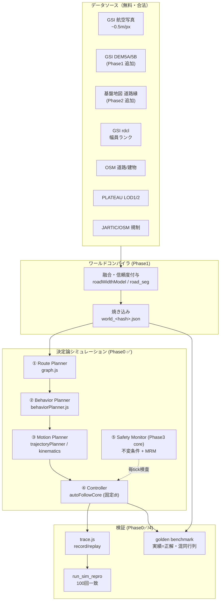
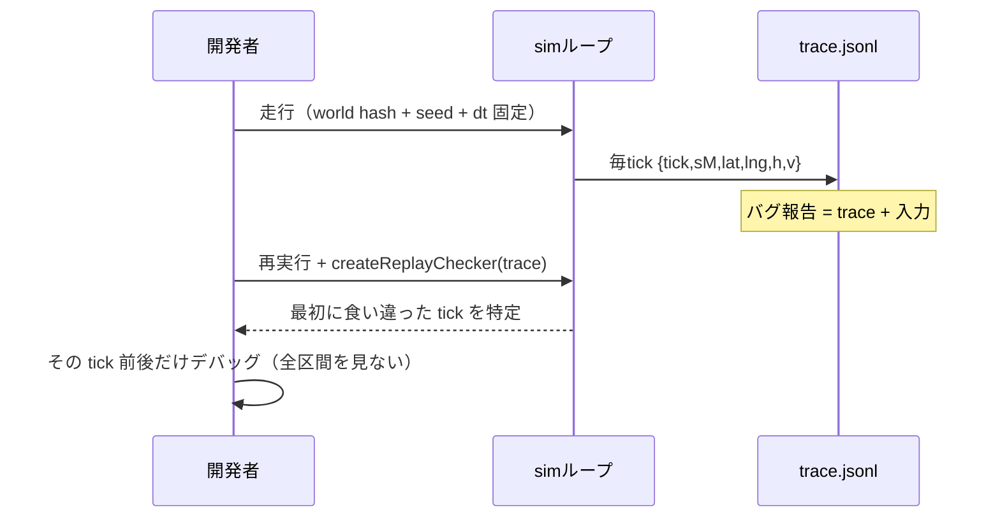

# L4SIM 技術ダイアグラム

## 1. 全体アーキテクチャ（データ→世界→自動運転→検証）



## 2. Phase 0 決定論ループ（実装済みの心臓部）

```
 requestAnimationFrame(可変 16.7ms±)          固定タイムステップ物理
┌─────────────────────────────┐   simAcc    ┌──────────────────────────────┐
│ フレーム到着: frameDt を計測 │──────────▶│ while (simAcc >= 0.05s):      │
│ （揺らぎ・PC性能に依存）     │  貯める     │   simTimeS += 0.05            │
└─────────────────────────────┘             │   0.35s毎: _detectOffRoad()   │
                                            │   v = allowedSpeed(sM)        │
        描画は状態を読むだけ                 │   sM += v * 0.05              │
┌─────────────────────────────┐             │   trace.push({tick,sM,v,...}) │
│ marker/HUD/trail 更新        │◀───────────│  （幾何は autoFollowCore 共有）│
└─────────────────────────────┘   state     └──────────────────────────────┘

検証済み: 揺らぎdtを注入しても trace ハッシュ f1d5add4 で不変（run_sim_repro [3]）
```

## 3. record/replay によるバグ再現フロー



## 4. 幅精度の多ソース融合（既存＋計画）

```
 手動上書き(1.00) ─┐                                    ┌→ 判定 buildRoadUnion
 FGD道路縁(0.88)★─┤                                    │
 OSM width(0.85) ──┼→ fuseWidthForFeature ─ confidence ─┼→ 自動走行 減速率
 航空写真AI(0.78)★┤   （低い値に保守化）      │        │
 SV/YOLO(0.75) ────┤                          ▼        └→ 2D/3D 表示幅
 GSI範囲(0.72) ────┤                    applyWidthRisk
 highway既定(0.60)─┘                   （不確実→幅を下振れ）
                        ★=Phase2で追加。相互矛盾は disagreement として確認待ちへ
```

## 5. シナリオ行列（Phase 4）

```
        車種:  2t / 3t / 4t / 10t
      × 幅帯:  <3.5 / 3.5-4.5 / 4.5-6 / 6m+
      × 形状:  直線 / 直角 / クランク / S字 / 切り返し
      × 勾配:  平坦 / 5% / 10%
      ─────────────────────────────────
      = 240セル を夜間ヘッドレス全走行
      各セル: PASS / MRM停止(理由コード) / Monitor違反(=バグ)
```

## 6. ファイル配置

```
src/sim/
  autoFollowCore.js   … 決定論コア（幾何+RNG+固定dtシム）✅
  trace.js            … record/replay ✅
  vehicleModel.js     … 車両正規化（既存）
  kinematics.js       … 曲率→速度プロファイル（既存）
  autonomy/behaviorPlanner.js … 挙動計画（既存）
src/batch/
  run_sim_repro.js    … 決定論検証ハーネス ✅
  run_golden_benchmark.js … ゴールデン回帰（既存・Phase2で拡張）
road_seg/             … 幅推定・教師データ・学習（既存一式）
docs/l4sim/           … 本ドキュメント群
```
