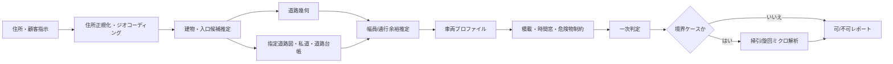

# 日本のラストメートル配送物理判定市場における競合比較レポート

## エグゼクティブサマリ

本調査では、トラックルーティング、掃引CAD、物流向けSaaS、地図ベンダー、3D都市モデル基盤をまたぐ主要11ツールを、指定の10軸で0–5点評価した。公開一次資料ベースで見る限り、**日本の狭隘住宅地・私道文脈で、ラストメートル物理判定、積載モデル、住所→判定自動化を同時に強く満たす単一製品は確認できなかった**。NAVITIME は日本の狭隘路・幅員表示に強い一方で公開資料上の積載制約モデルは限定的であり、PTV/HERE は積載・最適化に強い一方で日本の私道・住宅地データ統合を公開資料では前面化していない。Esri はVRPと3D/GIS統合が強いが、StreetMap Premium Japan の公表仕様では truck restrictions が「No」である。 citeturn23search0turn21search1turn36search10turn35search21turn24search6

**日本市場の現場適合性で最も強いのは NAVITIME 系**である。大型車ルート、車高・車幅・重量規制、走行実績、住宅街向けの道路幅員表示、ゼンリン住宅地図連携、建物名・テナント名検索、時間帯指定を考慮した配達順最適化まで、配送実務の“最後の数百メートル”に最も近い体験を出している。特に配達NAVITIME の幅員表示と、トラックカーナビの大型車規制対応は、日本のラストワンマイル用途で現時点の基準点になっている。 citeturn23search0turn21search1turn21search2turn23search1turn7search2turn7search5

一方で、**エンタープライズ実装の器としては PTV、Esri、HERE が強い**。PTV は車両属性・時間窓・容量・混載禁止など制約表現が厚く、クラウドとオンプレの両方を持つ。Esri はVRP、3Dシーン、オンプレ、外部GISデータ統合で強く、HERE はトラック規制とTour Planningの容量制約、3D SDK、pay-as-you-grow の実装しやすさがある。だが、これらは日本の私道・袋小路・住宅地入口レベルの“最終可否判定”をそのまま出す製品ではなく、追加データと実装で埋める前提が強い。 citeturn36search1turn36search18turn25search0turn24search0turn24search7turn24search6turn35search4turn28search3turn18search7turn18search2

**掃引/旋回そのものの精度では AutoTURN と Autodesk Vehicle Tracking が優位**である。両者はカスタム車両、後輪操舵、3D アニメーションやクリアランス確認に強く、現場の通行可否を“幾何学的に検証する最後の審判”として有効である。しかし、住所入力から自動で候補道路を選び、日本の私道・指定道路・住宅地入口まで含めて一括判定する思想ではない。つまり、両者は**自動判定エンジンではなく、最終検証エンジン**として位置づけるのが妥当である。 citeturn34search0turn34search1turn34search6turn34search21turn33search21turn33search10turn33search17

日本の公的データは、**道路形状、幅員、建築基準法上の道路種別、私道性、入口・表札・建物粒度**が別系統に分断されている。国土地理院の基盤地図情報は道路縁や道路面を持ち、国土数値情報は幅員区分付きの道路中心線を持つが、私道や建築基準法上の道路種別を一元的に保証するものではない。東京都・横浜市・京都市などの道路台帳は幅員確認に有用だが、対象は主に管理道路であり、京都市は私有道路など認定路線以外の幅員は確認できないと明記する。建築基準法上の道路種別は指定道路図で確認できるが、自治体Webマップ側は形状や幅員を完全には示さない場合がある。ここが市場ギャップの中核である。 citeturn37search1turn37search4turn37search7turn27search0turn27search5turn27search6turn27search10turn12search1turn12search3turn12search7turn12search9

結論として、**我がアプリの機会は「既存アルゴリズムの代替」ではなく、「日本の私道・住宅地・指定道路・幅員・入口情報を、積載制約付きの配送判定フローに統合し、説明可能なアウトプットに変換する中間レイヤー」**にある。路線最適化そのものは成熟分野で、OR-Tools のような標準的解法群も広く使われ、関連特許も厚い。差別化の主戦場は、一般VRPではなく、日本固有データの融合、境界ケースだけを掃引解析へ送る二段階判定、そして「なぜ不可か」を現場に説明できるレポート設計である。 citeturn31search12turn31search1turn31search4turn32search0turn32search17turn14search2

## 調査範囲と採点方法

本レポートでは、公開一次資料の量と、日本のラストメートル配送物理判定という競争テーマへの近接性を基準に、以下の11製品群を主比較対象とした。**グローバルトラックルーティング**として HERE、PTV、Trimble、**国内配送/住宅地図系**として NAVITIME、ZENRIN、**掃引CAD**として AutoTURN、Autodesk Vehicle Tracking、**GIS/地図プラットフォーム**として Esri、Google Maps Platform、Mapbox、**3D都市モデル基盤**として Project PLATEAU を採用した。各社の個別OEM契約、非公開SDK、導入実績ベースの別契約オプションは、公開資料で確認できない場合は未指定とした。各ツールの存在と主要機能は、各社公式の製品概要・開発者向け文書・料金ページに基づく。 citeturn8search1turn25search4turn20search2turn21search9turn10search0turn16search2turn17search0turn24search11turn19search5turn15search15turn11search1

採点は「**公開資料ベースの out-of-the-box 能力**」を原則とした。つまり、外部SIや独自実装で後付け可能な能力ではなく、各製品が公式に持つ、あるいは公式に想定する能力を評価している。そのため Esri のような“拡張すれば強い”製品は、潜在力ではなく公表された初期能力に寄せて採点している。逆に AutoTURN/Vehicle Tracking は掃引性能が強いが、住所からの自動判定がないため、そこは低く採点している。これは配送現場での競争比較としては保守的だが、実務上は最も誤差が少ない前提である。 citeturn24search5turn34search17turn33search10

| 記号 | 評価軸 | 評価の意味 | 重み |
|---|---|---|---|
| A | ラストメートル物理判定 | 最終進入可否を車両属性込みでどこまで判断できるか | 1 |
| B | 狭隘路カバレッジ | 日本の住宅地・細街路・袋小路・私道近傍への強さ | 1 |
| C | 道路幅取得精度 | 幅員の数値/区分をどれだけ直接取得・推定できるか | 1 |
| D | 掃引/旋回解析 | 幾何学的な車両旋回・オフトラッキング検証の強さ | 1 |
| E | 積載モデル | 容量・混載禁止・車両/荷物制約の表現力 | 1 |
| F | 3D可視化 | 3Dシーン、3Dタイル、車両3Dアニメーション等 | 1 |
| G | 住所→判定の自動化 | ジオコーディングから判定までの自動連結性 | 1 |
| H | 判定アウトプットの明快さ | 現場が読めるレポート/警告/ルート説明の出しやすさ | 1 |
| I | データ規約・商用適性 | 商用利用、オンプレ、保存、非公開運用への適性 | 1 |
| J | 導入形態/コスト | 導入のしやすさ、価格透明性、運用形態の柔軟性 | 1 |

点数の目安は、**5 = その軸で市場上位、4 = 強い、3 = 実用域、2 = 部分対応、1 = 限定的、0 = 公開資料ベースでは未対応**とした。不明点は「公開情報未指定」として扱い、推定で高得点にはしていない。これは、とくに日本の私道・指定道路・幅員のように、実務で誤判定コストが大きい領域では妥当な評価方針である。 citeturn27search5turn12search3turn30search5

## 競合スコア比較とランキング

まず、等重みの総合スコアを示す。右端の「T」は、ユーザーが重視する **A ラストメートル物理判定 + E 積載モデル + G 住所→判定自動化** の小計である。ここを見ると、総合点が近くても、プロダクト思想がかなり違うことが分かる。NAVITIME は日本実務寄り、PTV/HERE/Esri はエンタープライズ寄り、AutoTURN/Vehicle Tracking は最終検証寄りである。なお、同点の場合は T を参考に読むのが実務的である。 citeturn23search0turn36search18turn35search21turn24search7turn34search0turn33search10

| 順位 | ツール | 類型 | A | B | C | D | E | F | G | H | I | J | 合計/50 | T |
|---|---|---|---:|---:|---:|---:|---:|---:|---:|---:|---:|---:|---:|---:|
| 1 | NAVITIME | 国内配送/ナビ | 4 | 5 | 4 | 1 | 2 | 2 | 4 | 4 | 3 | 3 | **32** | 10 |
| 2 | Esri ArcGIS + StreetMap Premium Japan | GIS/解析基盤 | 2 | 2 | 2 | 1 | 4 | 4 | 4 | 4 | 5 | 2 | **30** | 10 |
| 3 | PTV Developer / Route Optimiser | トラックルーティング | 4 | 2 | 1 | 1 | 4 | 2 | 4 | 4 | 4 | 3 | **29** | 12 |
| 4 | HERE Routing / Tour Planning / SDK | トラックルーティング | 3 | 2 | 1 | 0 | 4 | 3 | 4 | 3 | 3 | 3 | **26** | 11 |
| 5 | Google Maps Platform | 地図/最適化 | 1 | 2 | 1 | 0 | 4 | 5 | 4 | 4 | 2 | 3 | **26** | 9 |
| 6 | AutoTURN | 掃引CAD | 3 | 1 | 1 | 5 | 2 | 3 | 0 | 4 | 4 | 2 | **25** | 5 |
| 7 | Trimble Maps | 商用車ルーティング | 4 | 1 | 1 | 0 | 3 | 2 | 3 | 4 | 4 | 2 | **24** | 10 |
| 8 | ZENRIN Maps API / 住宅地図系 | 国内地図/住所 | 3 | 5 | 2 | 0 | 1 | 1 | 4 | 3 | 3 | 2 | **24** | 8 |
| 9 | Autodesk Vehicle Tracking | 掃引CAD | 3 | 1 | 1 | 5 | 2 | 3 | 0 | 3 | 4 | 2 | **24** | 5 |
| 10 | Project PLATEAU | 3D都市モデル基盤 | 1 | 3 | 2 | 0 | 0 | 5 | 1 | 2 | 5 | 5 | **24** | 2 |
| 11 | Mapbox | 地図/SDK | 1 | 2 | 1 | 0 | 1 | 4 | 3 | 3 | 3 | 4 | **22** | 5 |

次に、各ツールの短い根拠メモを示す。**スコアは上表、理由は下記**として読むと分かりやすい。

**NAVITIME** は、大型車向けルート、車高/車幅/重量規制、走行実績、住宅地図、幅員表示、時間帯指定付き巡回により、日本のラストメートルに最も近い。配達NAVITIME は 3.0–4.0m と 3.0m未満の幅員表示を明示し、トラックカーナビは車高・車幅・重量・大型車通行止を考慮する。ただし、公開資料で多次元積載容量や混載禁止まで深くモデル化している記述は限定的で、掃引CAD相当の旋回解析も確認できない。 citeturn23search0turn23search1turn21search1turn21search2turn21search12turn7search2

**Esri** は、VRP、Directions 出力、3D Scene、オンプレ運用で非常に強い。一方で、StreetMap Premium Japan の公表仕様は geocoding level 1、local roads まで持つが、trucking restrictions は「No」であり、日本向けトラック規制データを最初から持つわけではない。したがって、**GIS統合基盤としては強いが、日本の商用車ラストメートル判定は追加データ前提**である。 citeturn24search0turn24search6turn24search7turn24search11turn6search5turn6search8

**PTV** は、トラック属性、高さ/重量制限、時間窓、ドライバー労務、容量、代替容量、混載禁止まで公開API上で扱える点が強い。Route Optimisation API と Routing API の組み合わせは、A/E/G/H/I のバランスが最も良い部類である。ただし、日本の私道・住宅地・狭隘路カバレッジや、道路幅を直接数値で返す仕様は公開資料では前景化されておらず、最終物理判定には日本ローカルデータの追加が必要になる。 citeturn36search1turn36search10turn36search18turn25search0turn25search1turn25search6

**HERE** は、truck mode、車両物性、危険物、休憩時間、環境ゾーン、Tour Planning の loading capacity を持ち、グローバルAPIとしてはかなり厚い。SDK と Rendering により 2D/3D も実装しやすい。しかし、日本の狭隘住宅地・私道・入口単位の最後の判断に関しては、NAVITIME/ゼンリン級の日本特化UXは見えず、公開資料でも日本ローカルの細街路判定を主張していない。 citeturn35search0turn35search4turn35search16turn35search17turn28search3turn18search2turn18search7

**Google Maps Platform** は、Geocoding、Routes、Route Optimization、3D Maps/Photorealistic 3D Tiles を持ち、住所→最適化→可視化の実装速度は高い。Route Optimization は shipments、vehicle load limits など積載側に強いが、Routes 側は travel mode 中心で、トラック寸法・道路幅・日本の私道法的種別には踏み込まない。さらに Routes コンテンツの非Google地図との併用制限や、Geocoding/Routes のキャッシュ制限があるため、商用統合では規約設計が必要である。 citeturn5search0turn5search6turn19search2turn19search3turn19search11turn19search14

**AutoTURN** は、掃引/旋回解析の市場標準クラスであり、loading docks、site/intersections、custom vehicles、2D/3D loads、3D clearance に強い。したがって D は最高評価で、境界ケースの最終検証エンジンとして有力である。ただし、日本の道路幅員や私道性を自ら取得する製品ではなく、住所→判定の自動化もない。AutoTURN Online の価格は公開されているが、判定前段のデータ融合は別システムが必要である。 citeturn34search0turn34search1turn34search2turn34search6turn34search21turn16search1

**Trimble Maps** は、商用車向け地図データ、車両寸法、hazmat、commercial restrictions、HOS break planning、time windowing、multi-vehicle optimization で強い。特に北米実務では非常に実用的な商用車基盤だが、日本の私道・住宅地・狭隘路と道路幅員の深さは公開資料で確認しにくい。公開価格も限定的で、導入は企業個別見積に寄りやすい。 citeturn20search0turn20search3turn20search4turn20search15turn29search2turn29search18

**ZENRIN** は、日本の建物・テナント・旧住所・表記ゆれ・入口・私道可視化で非常に強い。住所正規化や建物名/テナントを加味した特定は、日本の住所→判定自動化で大きな優位になりうる。また GODOOR の説明では私道やビル入口が確認できることも示される。ただし、公開資料ベースでは多車両容量最適化や掃引解析は見えず、ライセンスは保存・印刷等の条件が比較的厳格で、料金も初期費用・月額が発生する。 citeturn22search5turn22search6turn30search2turn22search0turn10search1

**Autodesk Vehicle Tracking** は、swept path prediction、rear steering、custom vehicles、load on trailer、3D animation に強く、AutoTURN と同じく境界ケース検証役に向く。だが、運用思想はCAD/BIM/InfraWorks/Civil 3D の設計検証であり、配送ルート自動判定とは別物である。導入も AEC Collection 経由で、住所→判定の自動流れは別実装になる。 citeturn33search21turn33search10turn33search17turn33search1turn33search4turn17search1

**Project PLATEAU** は、3D都市モデルと道路モデルを商用利用可のオープンデータとして配布し、Unity SDK も整っているため、3D可視化・都市デジタルツイン基盤としては最強クラスである。しかし、配送判定のための routing・capacity・decision output を持つ製品ではなく、実サービス化には別のルーティング/判定エンジンが必要である。要するに、PLATEAU は“完成品”より“土台”である。 citeturn11search1turn11search3turn11search0turn11search2turn11search4

**Mapbox** は、Japan address search、カスタマイズ性の高い地図SDK、3D表現、透明な従量価格で使いやすい。Directions は driving/driving-traffic/walking/cycling を中心にする一方、商用車寸法や日本の道路幅判定は公開ドキュメントでは前面化されない。さらに attribution 表示や temporary/permanent geocoding の利用条件を踏まえた設計が要る。よって、フロントエンド地図基盤としては強いが、物理判定エンジンとしては弱い。 citeturn15search1turn15search3turn15search6turn38search0turn38search1turn38search19turn38search15

**反証**も明確に置いておくべきである。PTV と HERE は A/E/G の三要素をかなり高い水準で持っており、Esri は統合基盤として極めて強い。したがって、「誰もやっていない真空市場」ではない。正確には、**“日本の私道・住宅地・入口・幅員まで落とし切った判定レイヤー”が薄い**のであって、一般的なルート最適化・車両制約・3D可視化市場は既に厚い。 citeturn36search18turn35search21turn24search0turn24search6turn23search0turn30search2

## 日本の私道・住宅地データ対応

日本で「その住所へその車両が実際に入れるか」を判断するには、少なくとも **道路形状、幅員、道路法上/建築基準法上の種別、私道性、建物入口/表札** の5系統が要る。ところが、これらは日本では単一データセットにまとまっていない。国土地理院系は形状、道路台帳は管理道路の幅員、指定道路図は建築基準法上の道路種別、民間住宅地図は入口や建物粒度に強いが、これらが同時にルーティングAPIへ乗るケースは少ない。 citeturn37search1turn37search7turn27search0turn27search10turn12search1turn30search2

| データ/制度 | 公的性格 | 何が分かるか | 制約・注意点 | 出所 |
|---|---|---|---|---|
| 基盤地図情報 | 国土地理院 | 道路縁、道路面、道路構成線、建築物外周などの幾何 | 法的な道路種別や私道性の一元保証ではない | citeturn37search1turn37search2turn37search4 |
| 国土数値情報 道路データ | 国交省 | 道路中心線、道路分類、幅員区分 | 道路法ベースの広域線形。ノードリンク構造なし。私道判定には不十分 | citeturn37search7 |
| 東京都道路台帳公開システム | 東京都 | 都道と一部国道の幅員情報 | 区市町村道・私道は対象外 | citeturn27search0 |
| 横浜市 よこはまのみち / 道路台帳 | 自治体 | 道路台帳図、現地実測距離としての幅員 | セットバック等で現況と差がありうる | citeturn27search1turn27search5turn27search9 |
| 京都市道路情報等提供システム | 自治体 | 認定路線の幅員、側溝寸法等 | 私有道路など認定路線以外の幅員は確認不可 | citeturn27search2turn27search6turn27search10 |
| 指定道路図・建築基準法道路マップ | 特定行政庁/自治体 | 建築基準法上の道路種別、指定道路、位置・幅員の公告制度 | Web版は形状・境界・幅員を完全表示しない場合がある | citeturn12search5turn12search1turn12search3turn12search7turn12search9turn12search11 |
| Project PLATEAU 道路モデル | 国交省/自治体 | 一部自治体の道路ポリゴン・3D道路モデル | 自治体依存・LOD依存。物流判定ロジックは別実装 | citeturn11search1turn11search3turn11search4turn11search7 |
| ZENRIN/GODOOR/NAVITIME | 民間 | 私道、ビル入口、表札、住宅地図、狭隘路可視化 | 生データ開放性や法的基準との対応は契約/仕様依存 | citeturn30search2turn22search5turn23search0 |

この分断が示す実務上の含意は明快である。**「道路幅員が取れること」と「その道が法的/運用的に配送車両で入ってよいこと」は別問題**であり、さらに「入口まで旋回できること」は第三の問題である。京都市が認定路線以外の幅員は確認不可とする一方、指定道路図は建築基準法上の道路種別を扱い、Taito の建築基準法道路マップは道路の幅員・境界位置・形状を完全には示さないと明記する。この構造では、単一の道路APIだけでは判定できない。 citeturn27search6turn12search5turn12search3

したがって、日本の私道・住宅地対応は、**公的データを重ねる設計**が前提になる。最低でも、基盤地図情報/国土数値情報で幾何を取り、道路台帳で管理道路幅員を補い、指定道路図で建築基準法上の道路性を確認し、ゼンリン/NAVITIME 系で入口・建物粒度・私道表示を補完する必要がある。ここを最初から1つの判定フローに束ねている競合は、公開範囲では確認しにくい。 citeturn37search1turn37search7turn27search0turn12search1turn30search2turn23search0

## 差別化要因と市場ギャップ

競争空間をカテゴリで見ると、埋まっている領域と空いている領域がはっきり分かれる。**全球トラックルーティング系**は A/E/G が強い。**国内住宅地図/ナビ系**は A/B/C/G が強い。**掃引CAD系**は A/D/F が強い。**GIS系**は E/F/G/I が強い。**3Dオープンデータ系**は B/F/I/J が強い。逆に、**A+B+C+E+G を同時に高く出す製品**、すなわち「日本の狭隘住宅地で、荷物制約付きで、住所から自動判定までつなぐ製品」が薄い。これが市場ギャップである。 citeturn36search18turn35search21turn23search0turn22search5turn34search0turn33search10turn24search0turn11search3

下図は、そのギャップを埋めるための実装イメージである。既存ツールが個別に持つ強みを、**住所正規化 → 建物/入口候補 → 道路法/建築基準法/私道/幅員統合 → 車両/積載制約 → 境界ケースだけ掃引解析** という順に束ねると、ちょうど市場空白に入る。道路幅員の統計的ばらつきや、掃引解析が速度や実走行と乖離しうることは学術研究でも示唆されており、全件を重い幾何解析に送るより、スコアリングとミクロ解析を分離した二段構えが合理的である。 citeturn14search2turn32search0turn32search17turn14search0

市場機会を語るうえでは、**反証**も先に押さえる必要がある。PTV/HERE/Esri を中心に、SI で組めば相当近い仕組みはすでに作れる。したがって、我がアプリの勝ち筋は「VRPアルゴリズムをもう一つ作ること」ではない。VRP は OR-Tools でも標準問題として整理され、関連特許も継続して出願されている成熟・混雑領域である。勝ち筋は、**日本ローカルデータの吸収・説明可能性・現場運用フィードバック**に寄せることだ。 citeturn31search12turn31search1turn31search4turn36search18turn35search21turn24search0

その観点からの**同時充足判定**は次のようになる。ここでの条件は「A≥3、E≥3、G≥3、かつ B≥3」である。これは“荷物を持った車が、日本の狭隘路条件下で、住所から自動判定に到達する”ための最低条件として置いた。

| ツール | A≥3 | E≥3 | G≥3 | B≥3 | 同時充足 |
|---|---|---|---|---|---|
| NAVITIME | ○ | × | ○ | ○ | **×** |
| PTV | ○ | ○ | ○ | × | **×** |
| HERE | ○ | ○ | ○ | × | **×** |
| Esri | × | ○ | ○ | × | **×** |
| Google | × | ○ | ○ | × | **×** |
| Trimble | ○ | ○ | ○ | × | **×** |
| ZENRIN | ○ | × | ○ | ○ | **×** |
| AutoTURN | ○ | × | × | × | **×** |
| Vehicle Tracking | ○ | × | × | × | **×** |
| PLATEAU | × | × | × | ○ | **×** |
| Mapbox | × | × | ○ | × | **×** |

この表が、我がアプリの位置づけを最も端的に示している。**市場空白は「1つも機能がない」ことではなく、「複数機能の交点が未製品化」である。** ここに、明確な差別化余地がある。 citeturn23search0turn36search18turn35search21turn24search6turn22search5

## 我がアプリの機会と技術課題

我がアプリが狙うべき機会は、**「日本の住所入力から、荷物・車両制約付きで、進入可否を説明可能なレポートに落とす」**ことにある。NAVITIME は日本の狭隘路に強く、PTV/HERE は積載制約に強く、AutoTURN/Vehicle Tracking は境界ケース検証に強い。ならば、これらの強みを同一UXに束ねる製品が最も価値を持つ。とくに、配車決定前に「この荷物・この車では不可。軽車両なら可。大型車なら手前停車＋台車搬送」と出せることは、手戻りコストの削減に直結する。 citeturn23search0turn21search1turn36search10turn35search4turn34search0turn33search10

ただし、主要懸念は三つある。第一に、**誤判定責任**である。道路台帳幅員と現況幅員は一致しないことがあり、建築基準法道路マップも形状や境界を厳密に示さない場合があるため、レポートは「法的確定」ではなく「運行判断支援」であることを明示する必要がある。第二に、**ライセンス依存**である。Google はキャッシュや地図併用に制約があり、ZENRIN も保存や印刷条件が細かい。第三に、**アルゴリズム差別化の困難さ**である。VRP自体は成熟しており、特許・既存ソルバ・大手APIが多いので、コア優位はデータ結合と説明可能性で作る必要がある。 citeturn27search5turn12search3turn19search2turn22search0turn31search12turn31search1turn31search4

技術課題は、次の表のとおりである。

| 技術課題 | なぜ難しいか | 参考根拠 |
|---|---|---|
| 住所正規化と入口推定 | 日本の住所は表記ゆれ、旧住所、マンション/テナント、入口位置が判定結果を左右する | citeturn22search5turn22search6turn7search2 |
| 私道・指定道路・管理道路の統合 | 形状、法的種別、管理主体、幅員が別データに分かれ、相互に完全整合しない | citeturn37search1turn27search0turn12search5turn27search6 |
| 幅員の“数値”と“有効通行幅”の差 | 統計的な道路幅員分布は一様でなく、現地障害物や停車車両で有効幅が変わる | citeturn14search2turn27search5turn30search5 |
| 掃引解析の発火条件 | 低速前提の掃引解析は実走速度や実地条件とずれる可能性があり、全件実行は重い | citeturn32search0turn32search17turn32search14 |
| 高精度地図更新 | LiDAR/点群/画像由来の幅員・縁石・障害物抽出には自己位置精度と更新運用が要る | citeturn14search0turn14search6 |
| 規約準拠のデータ保持 | 永続保存・再利用・非公開配信の境界がベンダーごとに違う | citeturn19search2turn38search1turn22search0 |

推奨アクションは、**短期・中期・長期**で分けるのがよい。

| フェーズ | 推奨アクション | 狙い |
|---|---|---|
| 短期 | 東京23区・政令市など自治体データが比較的整った地域に限定し、住所正規化、指定道路図連携、道路台帳/幅員統合、車両プロファイル登録、簡易可否判定を先に実装する | “使える精度”を速く作る |
| 中期 | 境界ケースだけ AutoTURN/Vehicle Tracking 相当の掃引解析へ送る二段階判定を実装し、不可理由をテンプレ化する。例として「車幅超過」「回頭余地不足」「私道/指定道路未確認」「現況障害疑い」を分ける | 説明可能性で差別化する |
| 長期 | ドライバー実績、停車位置、手押し搬送発生、再配達理由を回収し、独自の“最終100mデータセット”に育てる。PLATEAU や点群基盤はこの段階で 3D説明層として活かす | データモートを作る |

最終的な戦略メッセージは一つでよい。**我がアプリは、PTV/HERE/Esri と真正面から“配車最適化そのもの”で戦うべきではなく、NAVITIME/ZENRIN と真正面から“住宅地図閲覧そのもの”で戦うべきでもない。** 勝ち筋は、その間にある **「日本の住所から、荷物制約と道路制約を束ね、現場が判断できる可否レポートに変える判定OS」** を作ることである。そこでは、A・E・G を主軸にしつつ、B・C を日本ローカルデータで補い、D を境界ケース専用に使う構成が最も合理的である。 citeturn23search0turn36search18turn35search21turn24search6turn22search5turn34search0turn33search10turn11search3